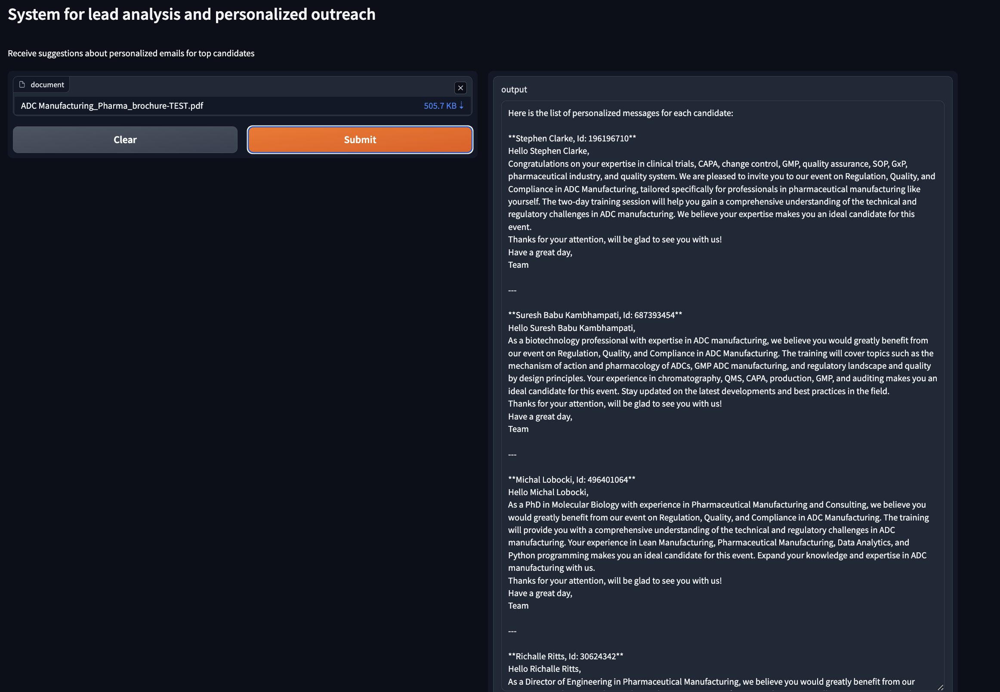

# Lead analysis and personalized outreach

## Setup

1. Python

    Make sure Python is installed on your system

2. Setting up environment

    Execute the following lines in the terminal to switch to your project folder (change path to the path to your local project directory) and create virtual environment:

    `cd path/to/project/folder`

    `python -m venv news_retrieval_multiagent_system_venv`

    To deactivate the virtual environment, simply run the following line in the terminal:

    `deactivate`

3. Install the required packages with the following line:

    `pip install -r requirements.txt`

4. Setting up Environment Variables

    - In the root directory of your project, create a file named `.env`.
    - Add your credentials

        Open the .env file in a text editor and add your API keys:

        (Groq API key can be generated in Groq console: [link to Groq console (keys)](https://console.groq.com/keys))

        ```
        GROQ_API_KEY='your_groq_api_key_here'
        ```

5. To run the application, run the corresponding file with:

    `python app.py`

    You will get private/public gradio url, where you will be able to test the model using simple ui.


## Results example


